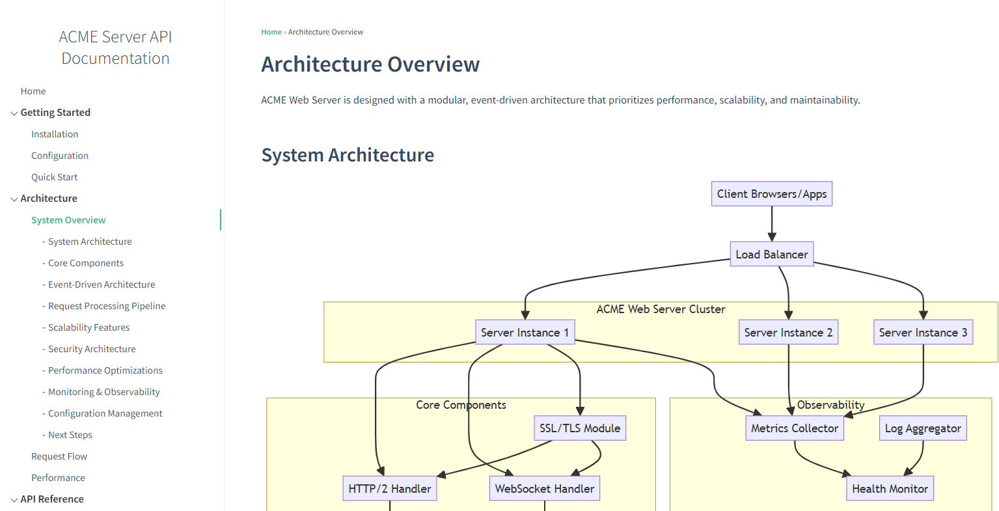

# Overview

This is a simple light weight web server implemented in C that can be used to serve documentation locally.
It serves content from a particular root folder and optionally runs a command after start-up, such as opening a browser to view the documentation.

It supports Windows, MacOS, Linux. 
Binary sizes:
- Windows ~285KB
- Linux ~22KB
- MacOS ~36KB

The `/docs` directory in this repository contains example documentation that can be served. This show-cases (docsify)[https://docsify.js.org] which can render markdown documentation to HTML on the fly, with mermaid diagram support.

A typical usecase would be to add the `showdocs` binary to a git repo and serve local markdown content, without the need to pre-render documentation to HTML.

See the releases section for pre-built binaries.

Example output:



# Building

Prerequisites:
- make, gcc

# Compilation

```
make
```

# Configuration

Edit `showdocs.ini` and amend as necessary.
See (CONFIG.md)[CONFIG.md] for more info.

# How to Run

```
./showdocs [--port 8080]
```