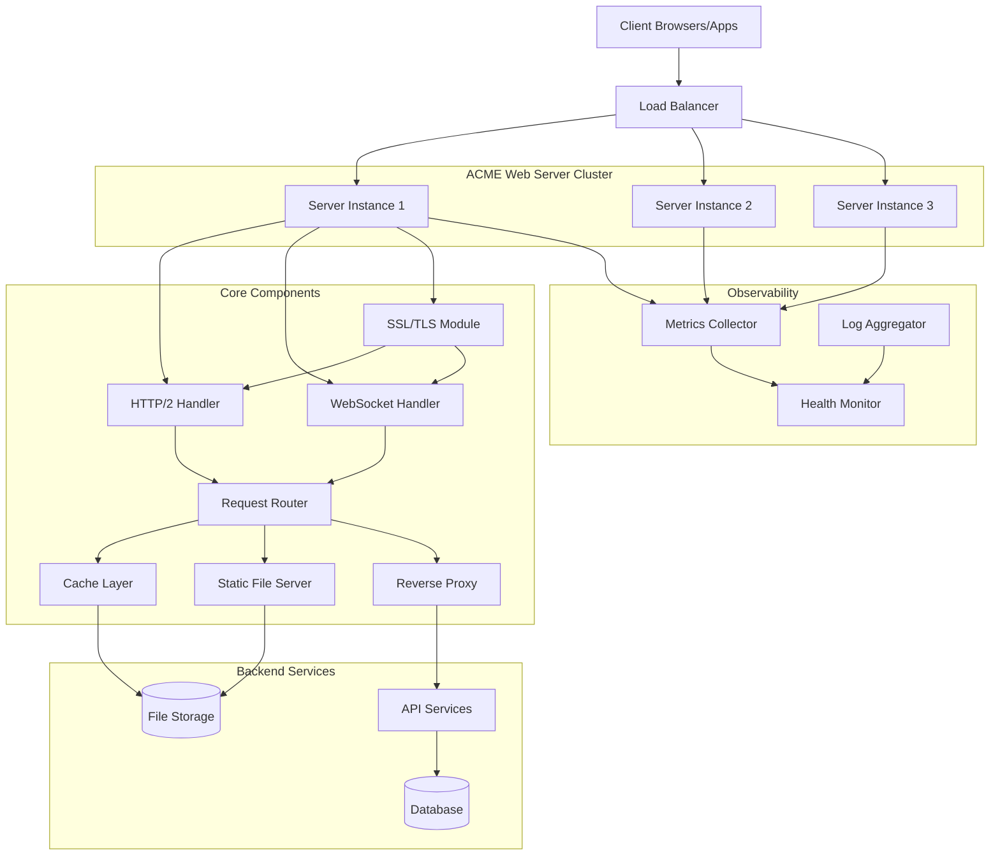
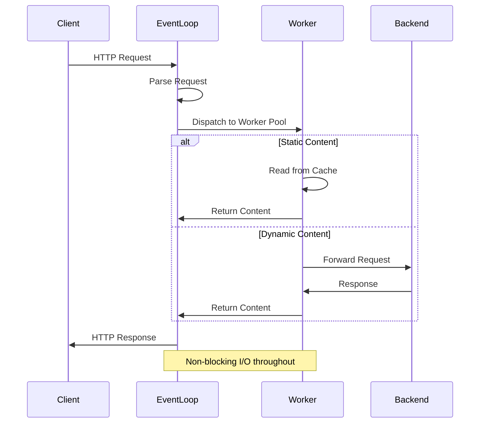

# Architecture Overview

ACME Web Server is designed with a modular, event-driven architecture that prioritizes performance, scalability, and maintainability.

## System Architecture



## Core Components

### 1. Connection Manager

Handles incoming TCP connections and manages the connection pool.

**Responsibilities:**
- Accept new connections
- Connection pooling and reuse
- Keep-alive management
- Connection timeout handling

**Key Features:**
- Supports 100K+ concurrent connections
- Automatic connection recycling
- Configurable timeout policies

### 2. Protocol Handlers

#### HTTP/2 Handler
- Full HTTP/2 support with multiplexing
- Server push capabilities
- Stream prioritization
- Header compression (HPACK)

#### WebSocket Handler
- RFC 6455 compliant
- Binary and text frame support
- Automatic ping/pong heartbeat
- Message fragmentation handling

### 3. Request Router

Intelligent routing based on:
- URL patterns (exact, prefix, regex)
- HTTP methods
- Headers and query parameters
- Custom routing logic

### 4. SSL/TLS Module

**Features:**
- TLS 1.2 and 1.3 support
- Automatic certificate management
- SNI (Server Name Indication)
- OCSP stapling
- Perfect forward secrecy

### 5. Cache Layer

Multi-tier caching system:
- **L1**: In-memory cache (LRU)
- **L2**: Shared cache (Redis compatible)
- **CDN Integration**: CloudFlare, Fastly support

### 6. Static File Server

Optimized static file serving:
- Zero-copy file transmission
- Automatic MIME type detection
- Range request support
- ETag generation and validation
- Gzip/Brotli compression

### 7. Reverse Proxy

Load balancing and proxying:
- Round-robin, least connections, IP hash
- Health checking
- Circuit breaker pattern
- Request/response modification

## Event-Driven Architecture

ACME Web Server uses an event-driven model with async I/O:



### Event Loop Model

- **Main Thread**: Accepts connections and distributes to workers
- **Worker Pool**: Processes requests asynchronously
- **I/O Threads**: Handles disk and network I/O

**Advantages:**
- Minimal context switching
- Efficient resource utilization
- High concurrency with low overhead

## Request Processing Pipeline

1. **Connection Establishment**
   - TCP handshake
   - SSL/TLS negotiation (if HTTPS)

2. **Request Parsing**
   - Parse HTTP headers
   - Validate request format
   - Extract routing information

3. **Middleware Chain**
   - Authentication
   - Rate limiting
   - Request logging
   - Custom middleware

4. **Route Matching**
   - Find matching route
   - Extract path parameters
   - Load route handlers

5. **Handler Execution**
   - Execute route handler
   - Process business logic
   - Generate response

6. **Response Processing**
   - Apply response middleware
   - Compression (if enabled)
   - Set security headers
   - Cache directives

7. **Response Delivery**
   - Send response headers
   - Stream response body
   - Connection management

## Scalability Features

### Horizontal Scaling

- **Stateless Design**: No session state in server instances
- **Distributed Caching**: Shared cache across instances
- **Load Balancing**: Built-in health checks and failover

### Vertical Scaling

- **Multi-core Support**: Automatically utilizes all CPU cores
- **Memory Management**: Configurable memory limits and GC tuning
- **Connection Pooling**: Efficient resource reuse

## Security Architecture

### Defense in Depth

1. **Network Layer**
   - DDoS protection
   - Rate limiting
   - IP whitelisting/blacklisting

2. **Transport Layer**
   - TLS 1.3 encryption
   - Certificate pinning
   - Secure cipher suites

3. **Application Layer**
   - Input validation
   - Output encoding
   - CSRF protection
   - XSS prevention

4. **Authentication & Authorization**
   - JWT support
   - OAuth 2.0 integration
   - API key management
   - Role-based access control

### Security Headers

Automatically applied:
```http
Strict-Transport-Security: max-age=31536000
X-Content-Type-Options: nosniff
X-Frame-Options: DENY
X-XSS-Protection: 1; mode=block
Content-Security-Policy: default-src 'self'
```

## Performance Optimizations

### Zero-Copy Transfer

Uses OS-level zero-copy (sendfile/splice) for static files, reducing CPU usage and improving throughput.

### Connection Pooling

Reuses connections to backend services, reducing connection overhead and latency.

### Smart Caching

- **Adaptive TTL**: Adjusts cache duration based on access patterns
- **Cache Warming**: Preloads frequently accessed content
- **Partial Content**: Caches byte ranges for large files

### Compression

- **Dynamic Compression**: Gzip/Brotli for text content
- **Precompressed Files**: Serves .gz/.br files if available
- **Compression Level**: Balances speed vs. compression ratio

## Monitoring & Observability

### Metrics Collection

- Request rate, latency, error rate
- Connection pool statistics
- Cache hit/miss ratios
- System resource usage

### Distributed Tracing

- OpenTelemetry integration
- Request ID propagation
- Span correlation across services

### Health Checks

- **Liveness**: Is the server running?
- **Readiness**: Can it accept traffic?
- **Startup**: Is initialization complete?

## Configuration Management

### Hot Reload

Changes to configuration can be applied without restart:
- Route updates
- SSL certificate rotation
- Cache settings
- Logging configuration

### Environment-based Config

Supports multiple environments:
```yaml
environments:
  development:
    logging.level: debug
  production:
    logging.level: warn
    cache.enabled: true
```

## Next Steps

- [Request Flow](request-flow.md) - Detailed request processing flow
- [Performance Tuning](performance.md) - Optimization guide
- [Configuration Reference](configuration.md) - All configuration options
- [Deployment Guide](deployment.md) - Production deployment
