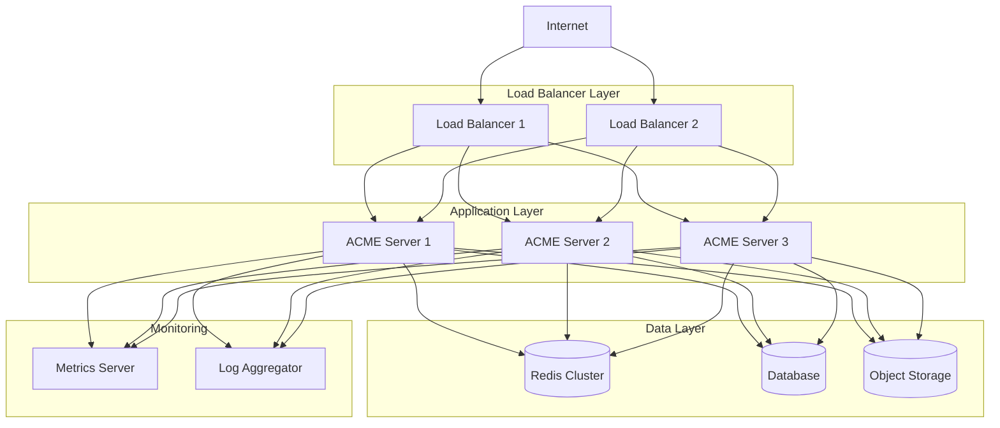

# Deployment Guide

This guide covers deploying ACME Web Server to production environments.

## Deployment Architecture



## Prerequisites

### Hardware Requirements

**Minimum (Small Traffic):**
- 2 vCPU
- 4GB RAM
- 20GB SSD
- 1 Gbps Network

**Recommended (Medium Traffic):**
- 4 vCPU
- 8GB RAM
- 100GB SSD
- 10 Gbps Network

**High Performance (Large Traffic):**
- 16+ vCPU
- 32GB+ RAM
- 500GB NVMe SSD
- 25+ Gbps Network

### Software Requirements

- Operating System: Ubuntu 22.04 LTS, CentOS 8+, or similar
- Firewall: Open ports 80, 443, 8080 (management)
- SSL Certificates: Valid certificates for your domain
- DNS: Properly configured A/AAAA records

## Deployment Methods

### 1. Docker Deployment

#### Single Instance

```bash
# Pull image
docker pull acme/web-server:latest

# Create configuration
cat > acme.yaml << EOF
server:
  host: 0.0.0.0
  port: 80
  workers: 4

ssl:
  enabled: true
  cert: /etc/ssl/cert.pem
  key: /etc/ssl/key.pem

logging:
  level: info
  output: stdout
EOF

# Run container
docker run -d \
  --name acme-server \
  --restart unless-stopped \
  -p 80:80 \
  -p 443:443 \
  -v $(pwd)/acme.yaml:/etc/acme/config.yaml \
  -v $(pwd)/ssl:/etc/ssl \
  -v $(pwd)/logs:/var/log/acme \
  acme/web-server:latest
```

#### Docker Compose

```yaml
# docker-compose.yml
version: '3.8'

services:
  acme-server:
    image: acme/web-server:latest
    restart: unless-stopped
    ports:
      - "80:80"
      - "443:443"
    volumes:
      - ./acme.yaml:/etc/acme/config.yaml
      - ./ssl:/etc/ssl
      - ./logs:/var/log/acme
      - ./public:/var/www
    environment:
      - ACME_LOG_LEVEL=info
      - ACME_WORKERS=4
    healthcheck:
      test: ["CMD", "curl", "-f", "http://localhost/health"]
      interval: 30s
      timeout: 10s
      retries: 3
    networks:
      - acme-network

  redis:
    image: redis:7-alpine
    restart: unless-stopped
    volumes:
      - redis-data:/data
    networks:
      - acme-network

networks:
  acme-network:
    driver: bridge

volumes:
  redis-data:
```

Start the stack:
```bash
docker-compose up -d
```

### 2. Kubernetes Deployment

#### Deployment Manifest

```yaml
# acme-deployment.yaml
apiVersion: apps/v1
kind: Deployment
metadata:
  name: acme-server
  labels:
    app: acme-server
spec:
  replicas: 3
  selector:
    matchLabels:
      app: acme-server
  template:
    metadata:
      labels:
        app: acme-server
    spec:
      containers:
      - name: acme-server
        image: acme/web-server:latest
        ports:
        - containerPort: 80
          name: http
        - containerPort: 443
          name: https
        resources:
          requests:
            memory: "2Gi"
            cpu: "1000m"
          limits:
            memory: "4Gi"
            cpu: "2000m"
        volumeMounts:
        - name: config
          mountPath: /etc/acme
        - name: ssl
          mountPath: /etc/ssl
        env:
        - name: ACME_WORKERS
          value: "4"
        livenessProbe:
          httpGet:
            path: /health
            port: 80
          initialDelaySeconds: 30
          periodSeconds: 10
        readinessProbe:
          httpGet:
            path: /ready
            port: 80
          initialDelaySeconds: 5
          periodSeconds: 5
      volumes:
      - name: config
        configMap:
          name: acme-config
      - name: ssl
        secret:
          secretName: acme-ssl
---
apiVersion: v1
kind: Service
metadata:
  name: acme-server
spec:
  type: LoadBalancer
  selector:
    app: acme-server
  ports:
  - name: http
    port: 80
    targetPort: 80
  - name: https
    port: 443
    targetPort: 443
---
apiVersion: v1
kind: ConfigMap
metadata:
  name: acme-config
data:
  acme.yaml: |
    server:
      host: 0.0.0.0
      port: 80
      workers: 4
    ssl:
      enabled: true
      cert: /etc/ssl/tls.crt
      key: /etc/ssl/tls.key
    logging:
      level: info
---
apiVersion: autoscaling/v2
kind: HorizontalPodAutoscaler
metadata:
  name: acme-server-hpa
spec:
  scaleTargetRef:
    apiVersion: apps/v1
    kind: Deployment
    name: acme-server
  minReplicas: 3
  maxReplicas: 10
  metrics:
  - type: Resource
    resource:
      name: cpu
      target:
        type: Utilization
        averageUtilization: 70
  - type: Resource
    resource:
      name: memory
      target:
        type: Utilization
        averageUtilization: 80
```

Deploy to Kubernetes:
```bash
# Create namespace
kubectl create namespace acme

# Create SSL secret
kubectl create secret tls acme-ssl \
  --cert=cert.pem \
  --key=key.pem \
  -n acme

# Apply manifests
kubectl apply -f acme-deployment.yaml -n acme

# Check status
kubectl get pods -n acme
kubectl get svc -n acme
```

### 3. Systemd Service (Linux)

```bash
# Install binary
sudo curl -L https://get.acme-server.io/acme-server -o /usr/local/bin/acme-server
sudo chmod +x /usr/local/bin/acme-server

# Create user
sudo useradd -r -s /bin/false acme

# Create directories
sudo mkdir -p /etc/acme /var/log/acme /var/lib/acme
sudo chown acme:acme /var/log/acme /var/lib/acme

# Copy configuration
sudo cp acme.yaml /etc/acme/
sudo chown acme:acme /etc/acme/acme.yaml
```

Create systemd service:
```ini
# /etc/systemd/system/acme-server.service
[Unit]
Description=ACME Web Server
After=network.target

[Service]
Type=simple
User=acme
Group=acme
WorkingDirectory=/var/lib/acme
ExecStart=/usr/local/bin/acme-server start --config /etc/acme/acme.yaml
ExecReload=/bin/kill -HUP $MAINPID
Restart=on-failure
RestartSec=5s

# Security
NoNewPrivileges=true
PrivateTmp=true
ProtectSystem=strict
ProtectHome=true
ReadWritePaths=/var/log/acme /var/lib/acme

# Resource limits
LimitNOFILE=1048576
LimitNPROC=512

[Install]
WantedBy=multi-user.target
```

Enable and start:
```bash
sudo systemctl daemon-reload
sudo systemctl enable acme-server
sudo systemctl start acme-server
sudo systemctl status acme-server
```

## SSL Certificate Setup

### Let's Encrypt (Certbot)

```bash
# Install certbot
sudo apt-get install certbot

# Obtain certificate
sudo certbot certonly --standalone \
  -d example.com \
  -d www.example.com \
  --email admin@example.com \
  --agree-tos

# Certificates will be in:
# /etc/letsencrypt/live/example.com/fullchain.pem
# /etc/letsencrypt/live/example.com/privkey.pem
```

Configure ACME Server:
```yaml
ssl:
  enabled: true
  cert: /etc/letsencrypt/live/example.com/fullchain.pem
  key: /etc/letsencrypt/live/example.com/privkey.pem
```

Auto-renewal:
```bash
# Add to crontab
0 0 * * * certbot renew --quiet --deploy-hook "systemctl reload acme-server"
```

### Custom Certificates

```yaml
ssl:
  enabled: true
  cert: /etc/ssl/certs/example.com.crt
  key: /etc/ssl/private/example.com.key
  chain: /etc/ssl/certs/ca-bundle.crt
```

## Production Configuration

```yaml
# production.yaml
server:
  host: 0.0.0.0
  port: 80
  workers: 16
  max_connections: 100000
  timeout: 30s
  keep_alive_timeout: 120s

ssl:
  enabled: true
  cert: /etc/ssl/cert.pem
  key: /etc/ssl/key.pem
  protocols: [TLSv1.2, TLSv1.3]
  http2: true
  redirect_http: true
  ocsp_stapling: true

logging:
  level: warn
  format: json
  output: /var/log/acme/server.log
  rotation:
    enabled: true
    max_size: 100MB
    max_age: 30d

cache:
  enabled: true
  size: 8GB
  ttl: 3600
  redis:
    enabled: true
    host: redis.internal
    port: 6379

monitoring:
  metrics:
    enabled: true
    path: /metrics
  health:
    enabled: true
    path: /health

middleware:
  - type: cors
    enabled: true
    origins: ["https://example.com"]
    
  - type: rateLimit
    enabled: true
    limit: 1000
    window: 60s
    
  - type: headers
    response:
      add:
        Strict-Transport-Security: max-age=31536000
        X-Content-Type-Options: nosniff
        X-Frame-Options: DENY
```

## Monitoring & Health Checks

### Health Check Endpoint

```bash
curl http://localhost/health
```

Response:
```json
{
  "status": "healthy",
  "checks": {
    "database": "ok",
    "redis": "ok",
    "disk_space": "ok"
  }
}
```

### Prometheus Metrics

```bash
curl http://localhost/metrics
```

Configure Prometheus:
```yaml
# prometheus.yml
scrape_configs:
  - job_name: 'acme-server'
    static_configs:
      - targets: ['server1:8080', 'server2:8080', 'server3:8080']
    metrics_path: '/metrics'
    scrape_interval: 15s
```

## Load Balancer Configuration

### Nginx

```nginx
upstream acme_backend {
    least_conn;
    server 10.0.1.10:80 max_fails=3 fail_timeout=30s;
    server 10.0.1.11:80 max_fails=3 fail_timeout=30s;
    server 10.0.1.12:80 max_fails=3 fail_timeout=30s;
}

server {
    listen 80;
    server_name example.com;

    location / {
        proxy_pass http://acme_backend;
        proxy_set_header Host $host;
        proxy_set_header X-Real-IP $remote_addr;
        proxy_set_header X-Forwarded-For $proxy_add_x_forwarded_for;
        proxy_set_header X-Forwarded-Proto $scheme;
        
        # Health check
        proxy_next_upstream error timeout http_502 http_503 http_504;
    }
}
```

### HAProxy

```
frontend http_front
    bind *:80
    mode http
    default_backend acme_backend

backend acme_backend
    mode http
    balance leastconn
    option httpchk GET /health
    
    server server1 10.0.1.10:80 check
    server server2 10.0.1.11:80 check
    server server3 10.0.1.12:80 check
```

## Backup & Recovery

### Configuration Backup

```bash
# Backup script
#!/bin/bash
DATE=$(date +%Y%m%d)
tar -czf /backup/acme-config-$DATE.tar.gz \
  /etc/acme \
  /etc/ssl/acme
```

### Data Backup

```bash
# Backup logs and data
rsync -av /var/log/acme /backup/logs/
rsync -av /var/lib/acme /backup/data/
```

## Security Hardening

1. **Firewall Configuration**
```bash
sudo ufw allow 80/tcp
sudo ufw allow 443/tcp
sudo ufw enable
```

2. **Fail2ban**
```ini
# /etc/fail2ban/jail.local
[acme-server]
enabled = true
port = 80,443
filter = acme-server
logpath = /var/log/acme/access.log
maxretry = 5
bantime = 3600
```

3. **Regular Updates**
```bash
# Update ACME Server
sudo systemctl stop acme-server
sudo curl -L https://get.acme-server.io/acme-server -o /usr/local/bin/acme-server
sudo systemctl start acme-server
```

## Troubleshooting

### Check Logs

```bash
# Systemd logs
sudo journalctl -u acme-server -f

# Application logs
sudo tail -f /var/log/acme/server.log

# Docker logs
docker logs -f acme-server
```

### Common Issues

**Port already in use:**
```bash
sudo lsof -i :80
sudo systemctl stop apache2  # or nginx
```

**Permission denied:**
```bash
sudo setcap 'cap_net_bind_service=+ep' /usr/local/bin/acme-server
```

## Next Steps

- [Monitoring](monitoring.md) - Set up monitoring and alerts
- [Performance](performance.md) - Optimize for production
- [Configuration](configuration.md) - Advanced configuration
- [API Reference](api-reference.md) - Management API
