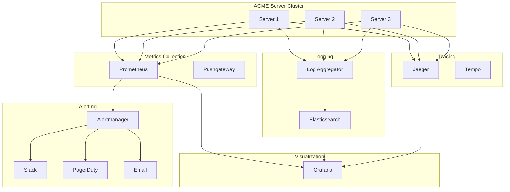

# Monitoring Guide

This guide covers setting up comprehensive monitoring and observability for ACME Web Server.

## Monitoring Architecture



## Metrics Collection

### Available Metrics

#### Request Metrics
```
acme_requests_total - Total number of requests
acme_requests_duration_seconds - Request duration histogram
acme_requests_in_flight - Current requests being processed
acme_request_size_bytes - Request size histogram
acme_response_size_bytes - Response size histogram
```

#### HTTP Status Metrics
```
acme_http_requests_total{status="200"} - Successful requests
acme_http_requests_total{status="404"} - Not found
acme_http_requests_total{status="500"} - Server errors
```

#### Cache Metrics
```
acme_cache_hits_total - Cache hit count
acme_cache_misses_total - Cache miss count
acme_cache_hit_rate - Cache hit rate percentage
acme_cache_size_bytes - Current cache size
acme_cache_evictions_total - Cache evictions
```

#### Connection Metrics
```
acme_connections_active - Active connections
acme_connections_total - Total connections handled
acme_connections_errors_total - Connection errors
acme_connection_duration_seconds - Connection duration
```

#### System Metrics
```
acme_cpu_usage_percent - CPU usage
acme_memory_usage_bytes - Memory usage
acme_memory_available_bytes - Available memory
acme_disk_usage_bytes - Disk usage
acme_network_bytes_sent - Network bytes sent
acme_network_bytes_received - Network bytes received
```

### Prometheus Configuration

```yaml
# prometheus.yml
global:
  scrape_interval: 15s
  evaluation_interval: 15s

scrape_configs:
  - job_name: 'acme-server'
    static_configs:
      - targets:
          - 'server1:8080'
          - 'server2:8080'
          - 'server3:8080'
    metrics_path: '/metrics'
    
  - job_name: 'acme-server-high-frequency'
    scrape_interval: 5s
    static_configs:
      - targets: ['server1:8080']
    metrics_path: '/metrics'
    
rule_files:
  - 'alerts.yml'

alerting:
  alertmanagers:
    - static_configs:
        - targets: ['alertmanager:9093']
```

### Alert Rules

```yaml
# alerts.yml
groups:
  - name: acme_server_alerts
    interval: 30s
    rules:
      # High error rate
      - alert: HighErrorRate
        expr: |
          rate(acme_http_requests_total{status=~"5.."}[5m]) > 0.05
        for: 5m
        labels:
          severity: critical
        annotations:
          summary: "High error rate detected"
          description: "Error rate is {{ $value }} (threshold: 0.05)"
          
      # High latency
      - alert: HighLatency
        expr: |
          histogram_quantile(0.95, 
            rate(acme_requests_duration_seconds_bucket[5m])
          ) > 1.0
        for: 5m
        labels:
          severity: warning
        annotations:
          summary: "High latency detected"
          description: "P95 latency is {{ $value }}s (threshold: 1.0s)"
          
      # Low cache hit rate
      - alert: LowCacheHitRate
        expr: acme_cache_hit_rate < 0.7
        for: 10m
        labels:
          severity: warning
        annotations:
          summary: "Low cache hit rate"
          description: "Cache hit rate is {{ $value }} (threshold: 0.7)"
          
      # High memory usage
      - alert: HighMemoryUsage
        expr: |
          (acme_memory_usage_bytes / acme_memory_available_bytes) > 0.9
        for: 5m
        labels:
          severity: warning
        annotations:
          summary: "High memory usage"
          description: "Memory usage is {{ $value }}%"
          
      # Server down
      - alert: ServerDown
        expr: up{job="acme-server"} == 0
        for: 1m
        labels:
          severity: critical
        annotations:
          summary: "Server is down"
          description: "{{ $labels.instance }} has been down for 1 minute"
          
      # Too many connections
      - alert: TooManyConnections
        expr: acme_connections_active > 50000
        for: 5m
        labels:
          severity: warning
        annotations:
          summary: "High connection count"
          description: "Active connections: {{ $value }}"
```

## Grafana Dashboards

### Overview Dashboard

```json
{
  "dashboard": {
    "title": "ACME Web Server Overview",
    "panels": [
      {
        "title": "Request Rate",
        "targets": [{
          "expr": "rate(acme_requests_total[5m])"
        }]
      },
      {
        "title": "Response Time (P95)",
        "targets": [{
          "expr": "histogram_quantile(0.95, rate(acme_requests_duration_seconds_bucket[5m]))"
        }]
      },
      {
        "title": "Error Rate",
        "targets": [{
          "expr": "rate(acme_http_requests_total{status=~\"5..\"}[5m])"
        }]
      },
      {
        "title": "Active Connections",
        "targets": [{
          "expr": "acme_connections_active"
        }]
      }
    ]
  }
}
```

Key dashboard panels:

1. **Request Metrics**
   - Request rate (req/s)
   - Success rate (%)
   - Error rate (%)

2. **Latency Metrics**
   - P50, P95, P99 latency
   - Average latency
   - Max latency

3. **System Resources**
   - CPU usage
   - Memory usage
   - Disk I/O
   - Network I/O

4. **Cache Performance**
   - Hit rate
   - Hit/Miss counts
   - Cache size
   - Evictions

5. **Connection Metrics**
   - Active connections
   - Connection rate
   - Connection errors

## Logging

### Log Configuration

```yaml
logging:
  level: info
  format: json
  output: /var/log/acme/server.log
  
  # Structured logging
  fields:
    service: acme-server
    environment: production
    version: 1.0.0
  
  # Access log
  access_log:
    enabled: true
    output: /var/log/acme/access.log
    format: json
    
  # Error log
  error_log:
    enabled: true
    output: /var/log/acme/error.log
    
  # Sampling (reduce log volume)
  sampling:
    enabled: true
    rate: 0.1  # Log 10% of requests
```

### Log Format

```json
{
  "timestamp": "2025-12-04T10:15:30.123Z",
  "level": "info",
  "service": "acme-server",
  "environment": "production",
  "request_id": "req_5a7b8c9d",
  "method": "GET",
  "path": "/api/users",
  "status": 200,
  "duration_ms": 45,
  "bytes_sent": 2048,
  "remote_addr": "192.168.1.100",
  "user_agent": "Mozilla/5.0...",
  "cache_status": "hit"
}
```

### ELK Stack Integration

```yaml
# filebeat.yml
filebeat.inputs:
  - type: log
    enabled: true
    paths:
      - /var/log/acme/*.log
    json.keys_under_root: true
    json.add_error_key: true
    
output.elasticsearch:
  hosts: ["elasticsearch:9200"]
  index: "acme-server-%{+yyyy.MM.dd}"
  
setup.kibana:
  host: "kibana:5601"
```

### Log Queries

**Find errors in last hour:**
```
level:error AND timestamp:[now-1h TO now]
```

**High latency requests:**
```
duration_ms:>1000 AND timestamp:[now-15m TO now]
```

**Failed authentication:**
```
status:401 AND path:/api/*
```

## Distributed Tracing

### OpenTelemetry Configuration

```yaml
tracing:
  enabled: true
  provider: opentelemetry
  
  # OTLP exporter
  exporter:
    endpoint: http://otel-collector:4317
    
  # Sampling strategy
  sampling:
    type: probabilistic
    rate: 0.1  # 10% sampling
    
  # Trace attributes
  attributes:
    service.name: acme-server
    service.version: 1.0.0
    deployment.environment: production
```

### Trace Example

```
Trace ID: 5a7b8c9d2e3f4a5b

Span: HTTP GET /api/users
├─ Duration: 245ms
├─ Status: OK
│
├─ Span: Auth Check
│  ├─ Duration: 15ms
│  └─ Status: OK
│
├─ Span: Cache Lookup
│  ├─ Duration: 5ms
│  └─ Status: MISS
│
└─ Span: Database Query
   ├─ Duration: 200ms
   ├─ Query: SELECT * FROM users WHERE role=?
   └─ Status: OK
```

## Health Checks

### Endpoint Configuration

```yaml
monitoring:
  health:
    enabled: true
    path: /health
    
    checks:
      # Liveness check
      - name: server
        type: liveness
        
      # Readiness checks
      - name: database
        type: readiness
        timeout: 5s
        
      - name: redis
        type: readiness
        timeout: 2s
        
      - name: disk_space
        type: readiness
        threshold: 90%
        
      - name: memory
        type: readiness
        threshold: 85%
```

### Health Check Response

```json
{
  "status": "healthy",
  "timestamp": "2025-12-04T10:15:30Z",
  "uptime": 3600,
  "checks": {
    "server": {
      "status": "ok"
    },
    "database": {
      "status": "ok",
      "latency_ms": 3
    },
    "redis": {
      "status": "ok",
      "latency_ms": 1
    },
    "disk_space": {
      "status": "ok",
      "usage_percent": 65
    },
    "memory": {
      "status": "ok",
      "usage_percent": 72
    }
  }
}
```

## Alerting

### Alertmanager Configuration

```yaml
# alertmanager.yml
global:
  resolve_timeout: 5m

route:
  group_by: ['alertname', 'severity']
  group_wait: 10s
  group_interval: 10s
  repeat_interval: 12h
  receiver: 'default'
  
  routes:
    - match:
        severity: critical
      receiver: 'pagerduty'
      
    - match:
        severity: warning
      receiver: 'slack'

receivers:
  - name: 'default'
    email_configs:
      - to: 'ops@example.com'
        
  - name: 'slack'
    slack_configs:
      - api_url: 'https://hooks.slack.com/services/...'
        channel: '#alerts'
        title: 'Alert: {{ .CommonLabels.alertname }}'
        text: '{{ range .Alerts }}{{ .Annotations.description }}{{ end }}'
        
  - name: 'pagerduty'
    pagerduty_configs:
      - service_key: 'your-pagerduty-key'
```

## Performance Dashboard

### Key Metrics to Monitor

1. **Golden Signals**
   - Latency (P50, P95, P99)
   - Traffic (requests/sec)
   - Errors (error rate)
   - Saturation (resource usage)

2. **RED Metrics**
   - Rate (requests/sec)
   - Errors (error count/rate)
   - Duration (latency)

3. **USE Metrics**
   - Utilization (CPU, memory, disk)
   - Saturation (queue depth)
   - Errors (system errors)

## Next Steps

- [Performance Tuning](performance.md) - Optimize based on metrics
- [Deployment](deployment.md) - Production deployment
- [Configuration](configuration.md) - Configure monitoring
- [API Reference](api-reference.md) - Metrics API
