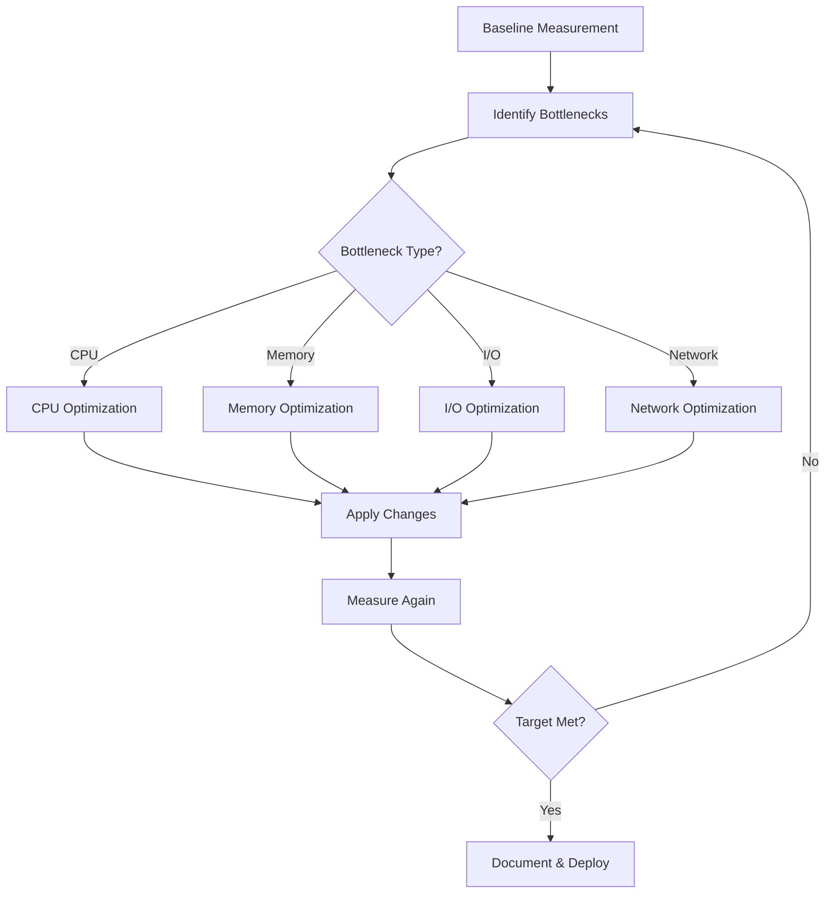
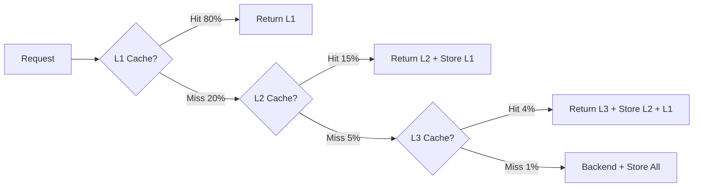
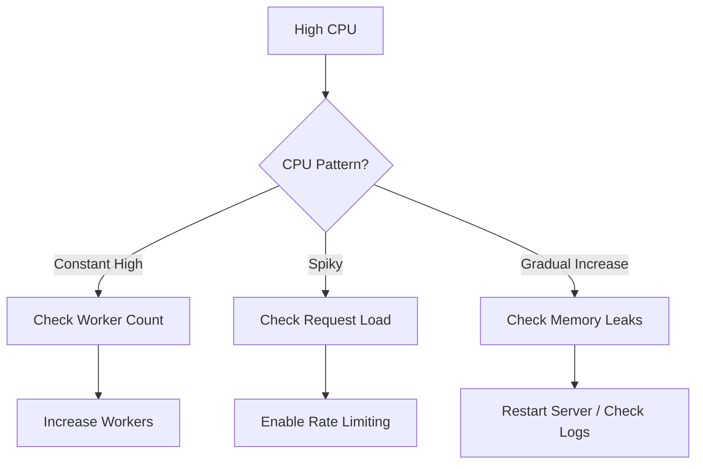

# Performance Tuning

This guide covers optimization strategies and performance tuning for ACME Web Server.

## Performance Benchmarks

### Standard Configuration

**Test Environment:**
- Instance: 4 vCPU, 8GB RAM
- Network: 1 Gbps
- Concurrent Users: 10,000

**Results:**

| Metric | Value |
|--------|-------|
| Requests/sec | 50,000 |
| Average Latency | 45ms |
| P95 Latency | 120ms |
| P99 Latency | 250ms |
| Max Concurrent Connections | 100,000 |
| Throughput | 2.5 GB/s |

### Optimized Configuration

**Test Environment:** Same as above

**Results:**

| Metric | Value |
|--------|-------|
| Requests/sec | 120,000 |
| Average Latency | 18ms |
| P95 Latency | 45ms |
| P99 Latency | 95ms |
| Max Concurrent Connections | 250,000 |
| Throughput | 5.8 GB/s |

## Performance Optimization Flow



## System-Level Optimizations

### Linux Kernel Tuning

```bash
# /etc/sysctl.conf

# Increase connection limits
net.core.somaxconn = 65535
net.ipv4.tcp_max_syn_backlog = 8192

# TCP tuning
net.ipv4.tcp_fin_timeout = 30
net.ipv4.tcp_keepalive_time = 300
net.ipv4.tcp_keepalive_probes = 5
net.ipv4.tcp_keepalive_intvl = 15

# Enable TCP fast open
net.ipv4.tcp_fastopen = 3

# Increase buffer sizes
net.core.rmem_max = 16777216
net.core.wmem_max = 16777216
net.ipv4.tcp_rmem = 4096 87380 16777216
net.ipv4.tcp_wmem = 4096 65536 16777216

# Connection tracking
net.netfilter.nf_conntrack_max = 1048576

# File descriptors
fs.file-max = 2097152
```

Apply changes:
```bash
sudo sysctl -p
```

### File Descriptor Limits

```bash
# /etc/security/limits.conf
*  soft  nofile  1048576
*  hard  nofile  1048576
```

Verify:
```bash
ulimit -n
# Should show: 1048576
```

## ACME Server Configuration Tuning

### Worker Configuration

```yaml
server:
  # Set to number of CPU cores
  workers: 8
  
  # Increase stack size for complex requests
  worker_stack_size: 4MB
  
  # I/O threads (1-2 per worker)
  io_threads: 16
  
  # Connection limits
  max_connections: 100000
  
  # Timeout tuning
  timeout: 30s
  keep_alive_timeout: 120s
```

### Memory Configuration

```yaml
cache:
  # Allocate 50-70% of available memory
  size: 4GB
  
  # Cache strategy
  eviction_policy: lru
  
  # Preload frequently accessed content
  preload:
    enabled: true
    paths:
      - /api/popular
      - /static/main.js
      - /static/styles.css
```

### Connection Pooling

```yaml
server:
  connection_pool:
    # Minimum idle connections
    min_idle: 100
    
    # Maximum connections per worker
    max_per_worker: 10000
    
    # Connection reuse
    reuse_connections: true
    
    # Pool timeout
    idle_timeout: 60s
```

## Caching Strategies

### Multi-Tier Cache Configuration

```yaml
cache:
  # L1: In-memory (fastest)
  l1:
    size: 2GB
    ttl: 300
    
  # L2: Redis (shared across instances)
  l2:
    enabled: true
    host: redis.internal
    port: 6379
    size: 8GB
    ttl: 3600
    
  # L3: CDN (global edge cache)
  cdn:
    enabled: true
    provider: cloudflare
    ttl: 86400
```

### Cache Hit Rate Optimization



**Target Metrics:**
- L1 Hit Rate: 80-90%
- L2 Hit Rate: 85-95%
- L3 Hit Rate: 95-99%
- Overall Hit Rate: >95%

### Smart Cache Warming

```yaml
cache:
  warming:
    enabled: true
    
    # Warm cache on startup
    on_startup:
      - path: /api/config
      - path: /api/popular-items
      - path: /static/main.bundle.js
    
    # Predictive warming based on access patterns
    predictive:
      enabled: true
      threshold: 10  # requests in last hour
      
    # Schedule warming
    scheduled:
      - cron: "0 6 * * *"  # 6 AM daily
        paths:
          - /api/daily-report
```

## Compression Optimization

### Configuration

```yaml
compression:
  # Enable compression
  enabled: true
  
  # Algorithms (order of preference)
  algorithms:
    - brotli
    - gzip
  
  # Compression level (1-11 for Brotli, 1-9 for Gzip)
  # Higher = better compression, more CPU
  level: 6
  
  # Minimum size to compress
  min_size: 1KB
  
  # Maximum size to compress (avoid huge files)
  max_size: 10MB
  
  # MIME types to compress
  types:
    - text/html
    - text/css
    - text/javascript
    - application/javascript
    - application/json
    - application/xml
    - image/svg+xml
  
  # Precompressed files
  precompressed:
    enabled: true
    extensions:
      - .gz
      - .br
```

### Compression Level Trade-offs

| Level | Compression Ratio | CPU Usage | Latency |
|-------|------------------|-----------|---------|
| 1 | 65% | Low | +2ms |
| 4 | 72% | Medium | +5ms |
| 6 | 76% | Medium-High | +8ms |
| 9 | 79% | High | +15ms |
| 11 | 81% | Very High | +25ms |

**Recommendation:** Level 6 provides the best balance.

## Static File Optimization

### Zero-Copy Serving

```yaml
static:
  # Enable zero-copy (sendfile/splice)
  zero_copy: true
  
  # Direct I/O for large files
  direct_io: true
  direct_io_threshold: 4MB
  
  # Memory-mapped files
  mmap:
    enabled: true
    threshold: 1MB
    max_size: 100MB
```

### ETag & Conditional Requests

```yaml
static:
  # ETag generation
  etag:
    enabled: true
    algorithm: md5  # or sha256
    
  # Last-Modified header
  last_modified: true
  
  # Support If-Modified-Since
  conditional_requests: true
```

### Asset Pipeline

```yaml
static:
  # Combine CSS/JS files
  concatenation:
    enabled: true
    patterns:
      - /static/css/*.css → /static/bundle.css
      - /static/js/*.js → /static/bundle.js
  
  # Minification
  minification:
    enabled: true
    css: true
    js: true
    html: true
  
  # Versioned URLs for cache busting
  versioning:
    enabled: true
    pattern: /static/{file}-{hash}.{ext}
```

## Database Query Optimization

### Connection Pooling

```yaml
database:
  # Connection pool size
  pool_size: 50
  
  # Minimum idle connections
  min_idle: 10
  
  # Connection lifetime
  max_lifetime: 30m
  
  # Connection timeout
  connect_timeout: 5s
  
  # Query timeout
  query_timeout: 10s
```

### Query Caching

```yaml
database:
  query_cache:
    enabled: true
    size: 1GB
    
    # Cache SELECT queries
    cache_selects: true
    
    # TTL based on query pattern
    rules:
      - pattern: "SELECT .* FROM users WHERE id = ?"
        ttl: 300
        
      - pattern: "SELECT .* FROM config"
        ttl: 3600
```

## Load Balancing Optimization

### Algorithm Selection

```yaml
load_balancing:
  # Algorithm choice
  algorithm: least_conn  # round_robin, least_conn, ip_hash
  
  # Health check
  health_check:
    interval: 5s
    timeout: 2s
    healthy_threshold: 2
    unhealthy_threshold: 3
  
  # Connection draining
  connection_draining:
    enabled: true
    timeout: 30s
  
  # Sticky sessions
  sticky_sessions:
    enabled: true
    cookie_name: ACME_BACKEND
    ttl: 3600
```

### Backend Server Weights

```yaml
backends:
  - url: http://backend1:8080
    weight: 5  # More powerful server
    
  - url: http://backend2:8080
    weight: 3  # Medium server
    
  - url: http://backend3:8080
    weight: 2  # Smaller server
```

## Monitoring & Profiling

### Key Metrics to Track

```yaml
monitoring:
  metrics:
    # Request metrics
    - request_rate
    - request_duration
    - request_size
    - response_size
    
    # Cache metrics
    - cache_hit_rate
    - cache_size
    - cache_evictions
    
    # Connection metrics
    - active_connections
    - connection_errors
    - connection_timeouts
    
    # Resource metrics
    - cpu_usage
    - memory_usage
    - disk_io
    - network_io
```

### Performance Dashboard

Access at: `http://your-server:8080/dashboard`

**Key Panels:**
1. Request Rate & Latency
2. Cache Hit Rates
3. Active Connections
4. Error Rates
5. Resource Usage

## Troubleshooting Performance Issues

### High CPU Usage



**Solutions:**
```yaml
server:
  workers: 16  # Increase workers
  
middleware:
  - type: rateLimit
    limit: 100
    window: 60s
```

### High Memory Usage

**Investigate:**
```bash
# Check memory usage
acme-server stats --memory

# Analyze heap
acme-server heap-dump --output heap.dump
```

**Optimize:**
```yaml
cache:
  size: 2GB  # Reduce cache size
  
  eviction_policy: lru  # More aggressive eviction
  
server:
  max_body_size: 5MB  # Limit request size
```

### Slow Response Times

**Profile Request:**
```bash
curl -w "@curl-format.txt" -o /dev/null -s http://localhost:8080/api/users
```

**curl-format.txt:**
```
time_namelookup:  %{time_namelookup}\n
time_connect:     %{time_connect}\n
time_appconnect:  %{time_appconnect}\n
time_pretransfer: %{time_pretransfer}\n
time_redirect:    %{time_redirect}\n
time_starttransfer: %{time_starttransfer}\n
time_total:       %{time_total}\n
```

## Optimization Checklist

- [ ] System kernel tuning applied
- [ ] File descriptor limits increased
- [ ] Worker count matches CPU cores
- [ ] Connection pooling configured
- [ ] Multi-tier caching enabled
- [ ] Compression enabled (level 6)
- [ ] Zero-copy file serving enabled
- [ ] ETag and conditional requests enabled
- [ ] Load balancing configured
- [ ] Health checks enabled
- [ ] Rate limiting configured
- [ ] Monitoring and alerts set up
- [ ] Performance benchmarks established

## Next Steps

- [Monitoring](monitoring.md) - Set up observability
- [Deployment](deployment.md) - Production deployment
- [Architecture](architecture.md) - System design
- [Configuration](configuration.md) - Configuration reference
